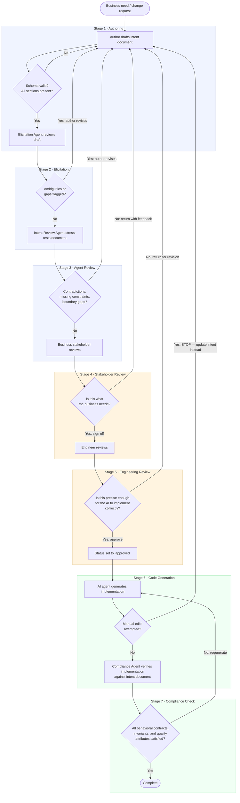

# Intent-Driven Development Workflow

## Overview

The workflow governs the lifecycle of an intent document from initial authoring through code generation and compliance verification. It is analogous to Gitflow: stages are explicit, gates between them are enforced, and moving backward is intentional (not accidental).

The fundamental constraint: **code generation cannot begin until an intent document reaches `approved` status. Generated code is never manually edited — doing so severs the chain between intent and implementation.**

---

## Diagram

---

## Stages

### Stage 1 · Authoring

**Actor:** Engineer or business stakeholder  
**Input:** A business need, feature request, or change request — expressed in any form  
**Output:** A draft intent document that passes schema validation and contains all required sections

The author is responsible for an initial attempt at capturing intent. The document does not need to be complete or unambiguous at this stage — that is what elicitation is for. It must be structurally valid (frontmatter parses against the JSON schema, no required sections missing) before advancing.

**Exit gate:** Schema validation passes. `status` is `draft`.

---

### Stage 2 · Elicitation

**Actor:** Intent Elicitation Agent  
**Input:** Draft intent document  
**Output:** Elicitation report listing ambiguities, underspecified edge cases, implicit assumptions, and missing coverage

The Elicitation Agent interviews the document rather than the author. It does not rewrite the document — it produces a structured report of what is unclear or absent. The author then revises the intent document in response. This loop repeats until the agent produces a clean report.

**Loop escalation:** If the document has not produced a clean elicitation report after three passes, stop looping and escalate directly to Stage 5 · Engineering Review. A document that cannot clear elicitation after three attempts has a structural problem — continued iteration with the agent is unlikely to resolve it. The engineer reviews the document in its current state and provides direct guidance to the author before elicitation resumes.

**Exit gate:** Elicitation report contains no unresolved flags. Author has addressed every item. The document re-passes schema validation after revisions.

---

### Stage 3 · Agent Review

**Actor:** Intent Review Agent  
**Input:** Elicitation-complete intent document  
**Output:** Review report identifying internal contradictions, missing constraints, logical gaps, and boundary conditions not covered by scenarios

Where the Elicitation Agent finds what is missing, the Intent Review Agent stress-tests what is present. It looks for: scenarios that contradict invariants, postconditions that cannot be satisfied given the preconditions, quality attribute thresholds that conflict with stated dependencies, and `must_not_know` boundaries that the intent document itself violates.

**Exit gate:** Review report contains no unresolved issues. Author has addressed every item.

---

### Stage 4 · Stakeholder Review

**Actor:** Business stakeholder  
**Input:** Agent-reviewed intent document  
**Question:** *Is this what the business needs?*

This is the first of two human review seams. The stakeholder is reviewing for semantic correctness — does the intent document accurately reflect the business outcome required? The stakeholder is not expected to evaluate technical precision or implementation feasibility. If the stakeholder returns the document, it goes back to Stage 1 (authoring) with their feedback.

On approval: the stakeholder's identity is added to the `reviewers` field. `status` advances to `review`.

**Exit gate:** Stakeholder sign-off. `status` is `review`.

---

### Stage 5 · Engineering Review

**Actor:** Engineer  
**Input:** Stakeholder-approved intent document (`status: review`)  
**Question:** *Is this precise enough for the AI to implement correctly?*

This is the second human review seam. The engineer is reviewing for implementation precision — are the behavioral contracts unambiguous? Are the quality attribute thresholds measurable? Are the dependency boundaries enforceable? Are the scenarios complete enough that an agent could generate correct, verifiable code without making assumptions?

The engineer does not review generated code. Review happens here, at the intent level, before any code exists. If the engineer returns the document, it goes back to Stage 1.

On approval: the engineer's identity is added to `reviewers`. `status` advances to `approved`.

**Exit gate:** Engineer sign-off. `status` is `approved`.

---

### Stage 6 · Code Generation

**Actor:** AI coding agent  
**Input:** Approved intent document (`status: approved`)  
**Output:** Implementation

The AI agent generates an implementation from the intent document combined with a project-level configuration document. The intent document captures behavior — what the unit does, its contracts, its constraints. The project config captures environment — target language and framework, coding standards, repo layout conventions, shared dependencies. These are legitimately project-wide concerns that should not be repeated in every intent document.

See [`templates/project-config.md`](../templates/project-config.md) for the project config template. Any instruction that applies to all code generation in the project belongs there; any instruction specific to this unit's behavior belongs in the intent document.

**The generated code is read-only.** If a developer identifies a problem in the implementation, the correct response is to update the intent document and regenerate — not to edit the code directly. Manual edits break the chain: the code is no longer derived from the intent, the intent no longer reflects the implementation, and the compliance check becomes meaningless.

**Exit gate:** Implementation produced. No manual edits applied.

---

### Stage 7 · Compliance Check

**Actor:** Compliance Agent  
**Input:** Approved intent document + generated implementation  
**Output:** Compliance report — pass/fail per behavioral contract item, invariant, and quality attribute threshold

The Compliance Agent verifies the implementation against the intent document independently of test results. Tests written by the AI can confirm the AI's interpretation of the intent — they cannot confirm the intent was correctly captured. The Compliance Agent breaks this circularity by checking the implementation against the source of truth directly.

If the compliance check fails, the implementation is regenerated (returning to Stage 6). Compliance failures do not trigger intent document updates unless the failure reveals a gap in the intent itself — in that case, the document returns to Stage 1 via the Intent Maintenance Agent. The engineer who approved the intent document at Stage 5 is the decision-maker for whether a compliance failure is an implementation defect (regenerate) or an intent gap (update the document and re-enter the workflow).

**Exit gate:** All behavioral contracts satisfied. All invariants hold. All quality attribute thresholds met or exceeded.

---

## Handling Changes

When a change is requested after an intent document has reached `approved` or later:

1. The **Intent Maintenance Agent** is invoked first. It updates the intent document and flags conflicts with existing intent.
2. The updated document re-enters the workflow at the appropriate stage (at minimum, Stage 5 · Engineering Review for any substantive change).
3. `status` reverts to `draft` on any edit.
4. Code is regenerated from the updated intent — existing implementation is discarded.

The intent document is always updated before any code changes. There is no path by which the implementation changes without the intent document changing first.

---

## Status Lifecycle

| Status | Meaning | Code generation permitted? |
|---|---|---|
| `draft` | Work in progress | No |
| `review` | Stakeholder approved, awaiting engineering sign-off | No |
| `approved` | Engineering approved, ready for generation | Yes |
| `deprecated` | Superseded or removed | No (legacy code only) |

---

## Two Review Seams

The workflow has two deliberate human checkpoints, each asking a different question:

| Seam | Stage | Actor | Question |
|---|---|---|---|
| Business → Engineering | Stage 4 | Business stakeholder | Is this what the business needs? |
| Engineering → AI | Stage 5 | Engineer | Is this precise enough to implement correctly? |

Separating these seams is intentional. A business stakeholder should not be asked to evaluate technical precision. An engineer should not be asked to validate business intent. Conflating them produces reviews that satisfy neither concern.
